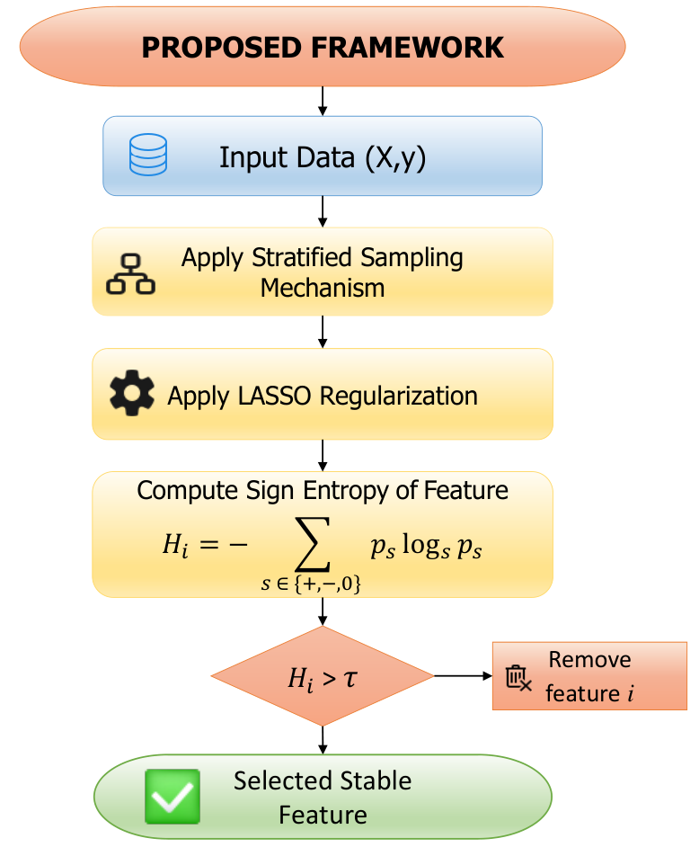
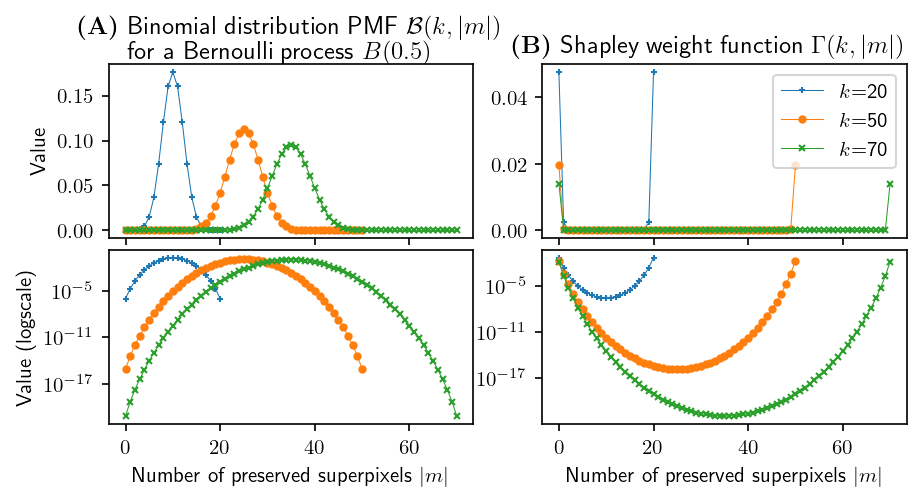
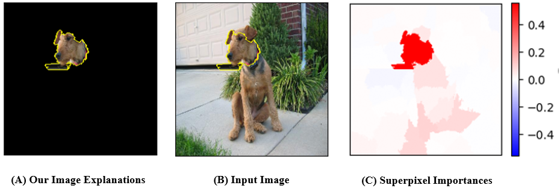
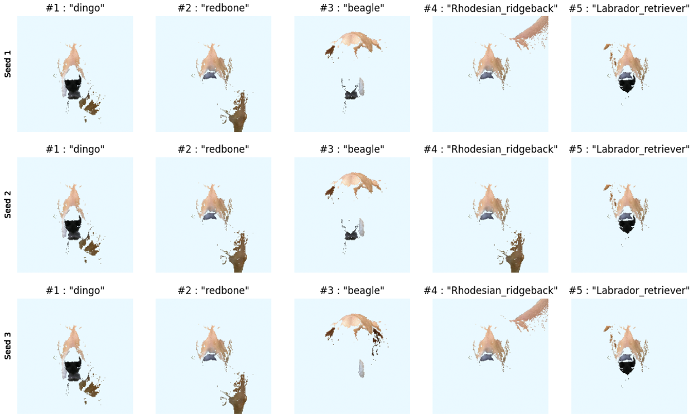

# SENSE-SLIME

A robust feature selection enhancement method for interpretable machine learning using **Stratified Sampling and Sign Entropy-based Stable Explanation (SENSE)** applied to **LIME/SLIME**-like explanation frameworks.

## Overview

SENSE-SLIME is an extension of SLIME (Supervised Local Interpretable Model-agnostic Explanations), introducing a feature selection strategy based on **stratified sampling & sign entropy** to filter out unstable features.

The approach uses LASSO to identify relevant features and then evaluates their **stability** using entropy of sign distributions across different runs.

### Methodology

The framework of SENSE-SLIME are illustrated below:



## Stratified Sampling Strategy


## Results




## Installation

```bash
git clone https://github.com/truongtankhoa90/SENSE-SLime.git
cd SENSE-SLime
pip install -r requirements.txt
```

## Requirements

- Python ≥ 3.7
- numpy
- scikit-learn
- lime
- matplotlib (optional, for visualization)
```

## References

- Ribeiro, M. T., Singh, S., & Guestrin, C. (2016). "Why Should I Trust You?": Explaining the Predictions of Any Classifier.
- Khoa, T. T. (2025). *Sign Entropy-based Stable Feature Selection for SLIME*.

## License

This project is licensed under the MIT License.
